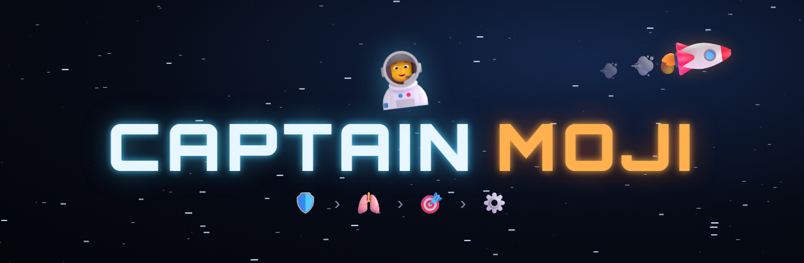

  

  

# Captain Moji 🧑‍🚀

Rundenbasiertes Sci-Fi-Roguelike im Browser – komplett mit Emojis als Grafik.

Das Raumschiff ist schwer beschädigt. Als Captain kämpfst du dich Deck für Deck bis zum Maschinenraum durch und reparierst unterwegs die wichtigsten Schiffssysteme.

## Spielen

**Online:** 👉 **[dasistdaniel.github.io/captainmoji](https://dasistdaniel.github.io/captainmoji/)** – läuft am PC und auf dem Handy (Querformat).

**Lokal:** `index.html` im Browser öffnen – kein Build, keine Abhängigkeiten.

## Steuerung

| | PC | Handy (Querformat) |
|---|---|---|
| Bewegen / Nahkampf | Pfeiltasten / WASD | Steuerkreuz links |
| Blaster (kostet 🔋) | Leertaste / F | Schießen |
| Medkit 🩹 | E / Q | Item |
| Warten | R | – |
| Ton an/aus | M | 🔊 im HUD |
| Pause / Run abbrechen | Esc | ⏸️ im HUD |

## Stand

Alle vier Decks sind spielbar – vom Schildgenerator bis zum Antrieb.

**Deck 1 – 🛡️ Schilde**
- Zufällig generierte Räume mit Raumtypen (Brücke, Lager, Kontrollraum, Quartier, Technik, Messe)
- 📦 Kisten zerschlagen oder zerschießen – manchmal steckt 🔋 oder 🩹 drin
- 🖥️ Terminals zeigen die Richtung zum Ziel und laden den Schiffsplan
- 🤖 Drohnen schlafen 💤, patrouillieren oder bewachen ihren Raum; entdeckt eine dich, gibt es Alarm 🚨
- Schlafende Drohnen erwischt man mit einem Überraschungsangriff (doppelter Schaden)
- Belohnung: 🛡️ Schild fängt regelmäßig einen Treffer ab

**Deck 2 – 🫁 Lebenserhaltung**
- 🫧 Sauerstoff sinkt jede Runde, 💨 Lecks lassen ihn schneller sinken – gegen das Leck laufen dichtet es ab
- 🫧 O₂-Stationen füllen einmalig auf; ohne Sauerstoff verliert man ❤️
- 🦠 Sporen vermehren sich, je länger man trödelt
- Belohnung: langsame ❤️-Regeneration

**Deck 3 – 🎯 Waffensysteme**
- 👾 Aliens: schlafen nie, halten 4 Treffer aus, treffen hart (−2 ❤️) und alarmieren kreischend ihre Artgenossen
- 🔒 Die Waffenkammer öffnet nur mit der 💳 Keycard – drinnen: 🔧, 🦺 Schutzweste (+2 max. ❤️), 🔋, 🩹, 💾
- 🖥️ Terminals orten Keycard und Werkzeug, befallene Räume voller 🕸️
- Belohnung: Blaster +1 Schaden

**Deck 4 – ⚙️ Maschinenraum (Finale)**
- 🔥 Feuer breitet sich aus, brennt ab und flammt durch Kurzschlüsse neu auf – im Feuer −1 ❤️ pro Zug
- 🧯 Feuerlöscher: gegen das Feuer laufen löscht ein 3×3-Feld
- ☢️ Reaktorräume sind verstrahlt – die Dosis steigt, alle 4 Punkte −1 ❤️
- 🐙 Boss: Das Tentakelmonster bewacht den Antrieb, peitscht 2 Felder weit und schickt 🦑 Tentakel los
- Antrieb reparieren = Schiff gerettet, Spiel gewonnen
- Abspann: Funkspruch von Chefingenieur Funke, Warp-Sprung in die Tiefen des Weltraums und Credits

**🔬 Forschungslabor (Meta-Progression)**
- 💾 Datenkerne: Drohnen lassen sie fallen, Kisten enthalten sie, jede reparierte Station gibt +3
- Kerne bleiben nach dem Tod erhalten (im Browser gespeichert) und werden im Labor ausgegeben
- Upgrades: ❤️ Verstärkter Anzug, 🩹 Notfallpaket, 🔋 Größere Energiezellen, 📡 Scanner
- 🤖 Reparatur-Droide (💾 30): folgt dem Captain, greift wache Gegner an, repariert alle 15 Züge +1 ❤️,
  wenn er neben dir steht; fällt er aus, wird er im nächsten Aufzug repariert. Hineinlaufen = Platz tauschen.

Zwischen den Decks geht es mit dem 🛗 Aufzug weiter; ❤️, 🔋, 🩹 und Boni bleiben erhalten.
Nebel des Krieges, Permadeath, Animationen und Sounds.
Musik und Schiffsgeräusche werden live im Browser erzeugt (`audio.js`), ganz ohne Audiodateien.

Zum Testen: `index.html?deck=2`, `?deck=3` oder `?deck=4` startet direkt auf dem jeweiligen Deck.
